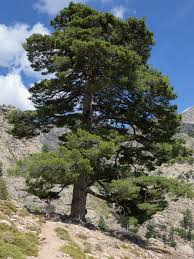

+ A study was conducted to describe the reproductive biology of an invasive species (Pinus nigra) in a native forest in Argentina. For this, the number of pines (or cones) produced in one year by each P. nigra specimen in the study area was recorded.
+ The age (by counting rings) and height (in meters) of each tree were also recorded.


```{r, cache=FALSE, warning=FALSE}
#Loading libraries
library(readxl)
library(carData)
library(ggplot2)
library(car)
library(MASS)
library(ggpubr)
library(equatiomatic)
library(knitr)
library(broom)
library(kableExtra)
```

```{r, echo = FALSE,cache=FALSE, warning=FALSE}
#Loading the data
pathBase = file.path(dirname(rstudioapi::getSourceEditorContext()$path))
pines <- read_excel(paste0(pathBase,'/pinusNigra.xlsx'))
attach(pines)
```




# Exploratory Analysis


```{r}
#For model performance analysis
supuestosGLM <- function(modeloGLM) {
  
  ajust <- fitted(modeloGLM) 
  rp <- resid(modeloGLM, type="pearson") 
  datos_p_supuestos <-data.frame(cbind(rp, ajust))

  k1<- ggplot(data=datos_p_supuestos, aes(x=ajust, y=rp)) +
    geom_point()   + 
    geom_jitter(width=0.1)+
  geom_line(y=2, linetype = "dashed", color="blue") + 
  geom_line(y=-2, linetype = "dashed", color="blue")+
  ylab("RP (per observed data)") + 
  xlab("Predicted (per model)") +
  labs(title = "RP vs predicted",
       caption = paste('.'))+ 
    theme_minimal()  

  datos_dist_cook = data.frame(cooks.distance(modeloGLM))
  for (i in (1:nrow(datos_dist_cook))) {
    datos_dist_cook$identidad[i]<- i  
  }
  names(datos_dist_cook)[1] <- "DCook"
  names(datos_dist_cook)[2] <- "Id"
  
  k2 <- ggplot(data=datos_dist_cook, aes(y=DCook, x=Id)) + 
  geom_point()   +  
  geom_line(y=1, linetype = "dashed", color="red", size =2) + 
  labs(title = "Cook's Distance",
       caption = "...")+
     theme_minimal()  
  
  graficos_supuestos = ggarrange(k1, k2, ncol=2, nrow=1)
  return (graficos_supuestos)
}

```

+ First let's inspect the data to explore how the number of cones are distributed as function of the tree's age, incorporating also the tree's height.

```{r}
ggplot(pines, aes(x = age_years, y = n_cones, color = height_m)) +
  geom_point(size=3) +  
  labs(title = "Cones number as function of age (years) and height (m)",
       x = "Age (years)",
       y = "Cone number",
       color = "Tree height (m)") +
  theme_minimal()  
```

# Statistical Modelling

### Poisson GLM
+ Per the response variable's nature, the first approach would be to use a Poisson GLM model.

```{r}
model_poi = glm(n_cones ~ age_years + height_m, family='poisson', data=pines)
```

+ Now let's see whether the model's assumptions are met.

```{r, echo = FALSE,cache=FALSE, warning=FALSE}
sup_GLM = supuestosGLM(model_poi)
sup_GLM
```

```{r}
model_poi_dispFact = sum(resid(model_poi , type="pearson")^2/model_poi $df.residual)
```

+ Upon checking assumptions, we can observe there are extreme values for Pearson's residues as well as leveraging datapoints per Cook's distance. 
+ Also, there should not be any suspicion of sub/overdispersion and in fact, the overdispersion factor exceeds what's allowed [Disp. factor = `r model_poi_dispFact`]. This could be due to a wide variety fo reasons including outliers, model's subspecification or lack of independence between observations.


### Negative Binomial GLM

+ One strategy to overcome overdispersion is to change the GLM distribution to Negative Binomial, which is useful for counting data with higher variance as expected per a Poisson GLM. 

```{r}
model_bn = glm.nb(n_cones ~ age_years * height_m, data=pines, link = log)
additive_bn = glm.nb(n_cones ~ age_years + height_m, data=pines, link = log)
age_bn = glm.nb(n_cones ~ age_years , data=pines, link = log)
height_bn = glm.nb(n_cones ~ height_m, data=pines, link = log)
kable(AIC(model_bn, additive_bn, age_bn, height_bn))
```


+ Now we can see that we have only one extreme value for RP vs predicted, and no leveraging datapoints.
+ Also per AIC criterion, the best model considers the interaction age x height.


```{r}
dispersion = sum(resid(model_bn, type="pearson")^2/(model_bn$df.residual+1))
dispersion 
sup_BN = supuestosGLM(model_bn)
sup_BN
```


+ Within Binomial Negative we estimate one additional parameter, the aggregation factor ('Theta') which accounts for the expected higher variance.


### Model interpretation

+ Model equation
```{r}
extract_eq(model_bn, greek_colors='blue', subscript_colors = 'blue')
```


### Model's results

```{r}
tidy_model_bn <- tidy(model_bn)

tidy_model_bn %>%
  kable("html", caption = "Summary of Negative Binomial Model ('model_bn')") %>%
  kable_styling(bootstrap_options = c("striped", "hover", "condensed"))
```


### Per the summary we can get
+ Significance of the interaction age x height, results must be analyzed considering this and not the variable's simple effect: the number of cones depends on the joint effect of these variables.
+ Estimated deviance  = `r round(summary(model_bn)$deviance,4)` %
+ Aggregation factor (Theta = `r round(summary(model_bn)$theta,3)`)

